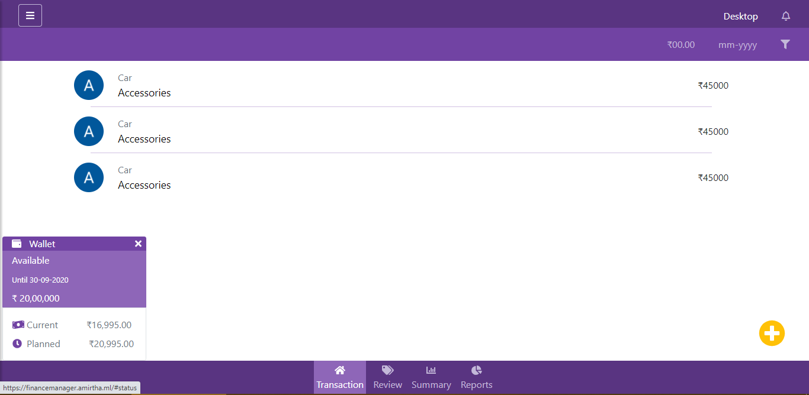

<h1 align="center">Finance Manager</h1>
<h2 align="center">
    
</h2>

## 🧱 Tech
- HTML
- CSS
- Bootstrap
- Angular

## 🧾 Description
It facilitates users to manage their revenue and expenses, cash flow, long-term investments, and reporting. This gathers and analyzes data from many sources at once.

## 💻 Setup
- Clone the repository

    ` git clone https://github.com/amirtha4501/FinanceManager.git `
- Boot up a terminal on the directory.
- Run the website on localhost
    - To run

        `ng serve`
    - To run and open

        `ng serve --open`
- To build, use the below commands according to your requirements

    `ng build`

    `ng build --prod `

    `ng build --prod --base-href "/"`

<h2 align="center">
    
    
<a href="https://financemanager.amirtha.ml" style="color:white">View Demo</a>

</h2>
